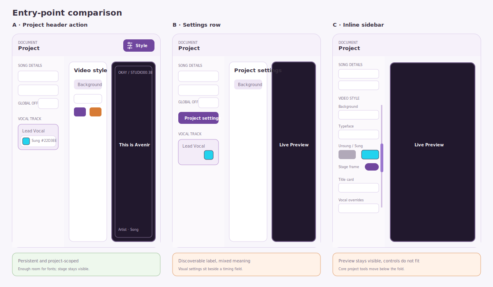
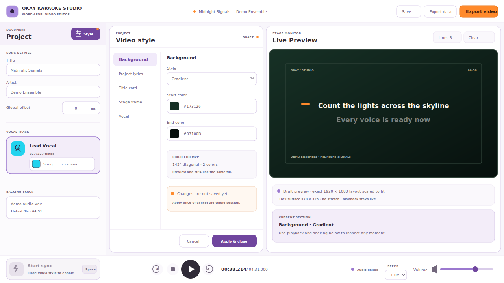
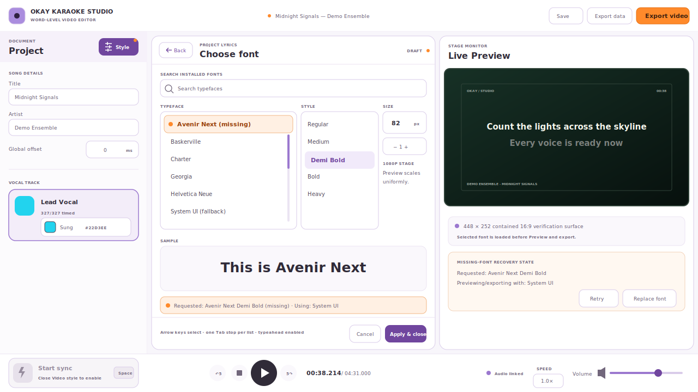

# Video Style Editor — Interaction Design

**Status:** Approved for implementation after adversarial UI/UX review
**MVP source:** [`MVP.md`](./MVP.md#video-style)
**Decision owner:** User-held version 0.1 product-acceptance gate

## Outcome

Use a visible **Style** action in the Project header. It opens a dedicated style
workspace inside the existing window, keeps a contained 16:9 Live Preview
visible, and temporarily covers—not destroys—the TimeBoard. Proposal A is the
only direction that makes the full MVP discoverable and usable at 1280 × 720.

The style session drafts only style fields. It has exactly two terminal actions:
**Cancel** and **Apply & close**. There is no third **Done** action.

## Problem

The Studio currently exposes one visual control: the color swatch on the active
vocal track. That swatch is the progressive sung color, but it is not visibly
named. The **Document / Project** sliders glyph looks actionable but is
decorative, and the narrow inspector has no coherent entry point for
project-wide video styling.

The editor must make the new MVP style model discoverable without turning the
270 px inspector into a long settings form or hiding the stage while the user
makes visual decisions.

## Design constraints

- Keep the single-window invariant and the existing Project → Preview →
  TimeBoard mental model.
- Keep Live Preview visible and playable while styles are adjusted.
- Preserve Global offset as a fast timing control; do not make a timing row
  carry unrelated project settings.
- Preserve the Lead Vocal sung-color swatch as a quick action and name it
  visibly.
- Give the installed-font browser enough width and height for Typeface, Style,
  Size, search, recovery, and the `This is <typeface>` sample.
- Fit the literal 1280 × 720 app chrome without clipping or horizontal
  scrolling. The stage is always contained at 16:9 and is never stretched.
- Make one styling session cancelable and one undoable project edit, not a long
  sequence of picker and slider history entries.
- Keep linked assets and missing-font/image failures explicit.
- Keep Preview and MP4 visually equivalent, including logical font sizing,
  line visibility, sync-aid timing, and missing-resource fallbacks.

## Entry-point proposals

| Proposal | Strengths | Blocking costs | Decision |
| --- | --- | --- | --- |
| **A. Project header action** | Project-scoped, always visible above the inspector scroller, and repairs the misleading decorative affordance. | Requires an inline workspace and explicit draft lifecycle. | **Selected** |
| **B. Song-details settings row** | A full-width label is discoverable and close to project metadata. | Conflates timing and visual settings. Replacing Global offset removes a valuable quick edit; adding another row crowds the inspector. | Rejected |
| **C. All controls inline** | Live Preview and transport remain visible with no mode change. | Font browsing, element typography, backgrounds, inheritance, and sync timing cannot fit comfortably at 270 px. | Rejected |

## Selected interaction

1. The Project header contains one labeled **Style** button with the sliders
   icon inside it. There is no separate raised icon tile. The button exposes an
   active/pressed state while the workspace is open.
2. Style mode occupies the main workspace. It visually covers the TimeBoard
   while leaving the TimeBoard mounted and inert, and keeps a live, playable
   16:9 stage beside the editor.
3. Global offset remains inline and editable.
4. The Lead Vocal card exposes a keyboard-operable quick control at least 32 px
   high, visibly reading `Sung  #FF8A2B` beside its swatch.
5. The quick control always edits the active vocal, never the project default.
   When Sung is inherited, accepting a new color creates a vocal Sung override
   seeded from the effective project value and turns off **Use project Sung**.
   When already overridden, it updates that override. Canceling the picker does
   neither. **Use project Sung** in the Vocal section removes the override.
6. Outside Style mode, accepting a quick Sung change is one immediate undoable
   edit. Inside Style mode, the same picker edits the style draft and does not
   enter project history until **Apply & close**.
7. The style editor provides the complete project and vocal controls described
   below.

This is a mode in the existing window, not a modal dialog or another window.
The existing modal pattern makes the stage inert and is unsuitable for a visual
editor based on continuous comparison.

## Literal minimum-window layout

At exactly 1280 × 720, the existing height breakpoint is part of the contract:

- Top bar: 58 px.
- Main row: 592 px, with the existing 270 px Project inspector and 1010 px
  workspace.
- Transport: 70 px and complete—Start Sync, skip back, Stop, play/pause, skip
  forward, time, playback speed, volume, and audio status.
- Workspace: 8 px outer padding and 8 px gap; 390 px style editor and 596 px
  preview card.
- Live video surface: 578 × 325 px (16:9, contained) inside the preview card.
  Unused card space holds status and warnings rather than stretching the video.

At taller working sizes, the existing 64 px top bar and 78 px transport remain;
the editor and preview grow vertically. The action row remains pinned.

## Information architecture

The style editor uses one visible section list and a scrollable detail region.
The persistent actions never scroll out of view.

### Background

- Mode: **Solid**, **Gradient**, or **Image**.
- Solid: one color.
- Gradient: **Start color** and **End color**, with a fixed 145° top-left to
  bottom-right direction for MVP. Advanced stops and geometry stay deferred.
- Image: **Choose image**, **Replace**, and **Clear**, with the linked filename
  and path visible. The image is centered and uses Cover; the same crop appears
  in Preview and MP4.
- Supported linked files are static PNG, JPEG, and WebP. SVG, animated GIF,
  HEIC, and video backgrounds are excluded.
- The absolute linked path is stored; image bytes are neither embedded nor
  copied. Missing or unreadable images remain a visible error and block export
  until replaced, cleared, or the background mode changes. Applying a draft may
  preserve that linked path, but it must also preserve the error and must not
  make MP4 appear ready. Both the Export UI and export command handler enforce
  the same readiness result.

### Project lyrics

- Font summary and **Choose font** action.
- Size, Unsung color, and Sung color.
- Values are defaults inherited by every vocal track unless that field is
  independently overridden.

### Title card

- Independent rows for eyebrow, title, and artist.
- Each role has visibility plus independent Typeface, Style, Size, and Color.
- The semantic title and artist continue to come from Song details.
- The title card yields at the first lyric visibility moment in playback time.
  Specifically,
  `handoffPlaybackMs = max(0, firstWordLyricMs + globalOffsetMs - previewMs)`.
  There is no independent fixed 1500 ms handoff.

### Stage frame

The user's “border” is modeled as stage chrome, not merely a CSS line. **Show
Stage frame** is the master switch for every retained frame/footer element. It
does not hide the background, title card, or lyrics.

| Retained role | Position/content | Controls |
| --- | --- | --- |
| Frame line | Inset outline | Color and logical 1080p width |
| Brand | Top left, `OKAY / STUDIO` | Visibility, Typeface, Style, Size, Color |
| Clock | Top right, current playback time | Visibility, Typeface, Style, Size, Color |
| Song metadata footer | Bottom left, Artist · Song | Visibility, Typeface, Style, Size, Color |

The export-only bottom-right `Okay Karaoke Studio` duplicate is removed rather
than promoted to another MVP role; it is absent from both Preview and MP4.

### Vocal

- Typeface, Style, Size, Unsung color, and Sung color each have an explicit
  **Use project setting** switch. Turning one inheritance switch off seeds the
  override with the current effective value and does not change other fields.
- Horizontal alignment: **Left**, **Center**, or **Right**.
- Preview time in milliseconds.
- Sync aid: enabled, minimum lead time, and maximum lead time.
- Dynamic plain-language copy summarizes whether the cue can render, for
  example: `First line after a blank row only. Starts up to 3.0 s early; skipped
  when less than 2.0 s is available.`

### Current v0 defaults

Sizes are logical pixels on a 1920 × 1080 stage. Live Preview scales the same
layout uniformly into its contained 16:9 surface.

| Setting | Default |
| --- | --- |
| Background | Gradient, Start `#322242`, End `#1E1629`; Solid `#21182D`; fixed 145° |
| Project lyrics | System UI / Extra Bold / 82 px; Unsung `#72687D`; Sung `#FF8A2B` |
| Title eyebrow | Visible; System UI / Extra Bold / 25 px / `#FFAD69` |
| Title | Visible; System UI / Extra Bold / 104 px / `#FBF9FD` |
| Title artist | Visible; System UI / Semi Bold / 42 px / `#B4ACBD` |
| Stage frame | On; 2 px / `#473C54` |
| Brand | Visible; System Monospace / Bold / 25 px / `#C1BBC7` |
| Clock | Visible; System Monospace / Semi Bold / 27 px / `#BBB7C0` |
| Song metadata footer | Visible; System UI / Bold / 24 px / `#B2AEB8` |
| Vocal | Inherit all project font/color fields; Center; Preview 3000 ms |
| Sync aid | Off; Minimum 2000 ms; Maximum 3000 ms |

The default stage deliberately omits the legacy fixed radial glows and title
divider. They are neither editable style roles nor hidden export-only effects;
Preview and MP4 render the same background, title card, and retained frame
elements without them.

## Font selector

**Choose font** opens a full-pane editor subview rather than a modal. At the
minimum window the editor temporarily grows from 390 to 520 px; the preview card
shrinks to 466 px and retains a 448 × 252 px contained 16:9 video surface.

- A Back action returns to the originating role without committing the style
  session.
- Search filters a grouped **Typeface** list; **Style** shows faces belonging to
  the selected typeface; **Size** is a numeric logical-pixel field. Filtering
  never changes the committed selection or its sample. If the selected family
  is filtered out, the Typeface list shows an unselected prompt until the user
  explicitly chooses a result.
- The typeface and style collections use single-select listbox/native-equivalent
  semantics with one Tab stop each. Arrow keys change the active option;
  Home/End and typeahead work; selection is announced.
- The persistent sample reads `This is <typeface>` using the selected face,
  style, and exact logical-pixel size. Its fixed-height viewport scrolls for a
  large sample instead of capping the font and making distinct sizes look the
  same.
- `System UI` and `System Monospace` are deterministic generic choices and
  remain available without font enumeration.
- Opening the selector from a visible user click requests installed-font access.
  Permission denial or an unavailable API preserves the requested face and
  exposes **Retry**; it never silently replaces the project value.
- A missing face says both `Requested: <face> (missing)` and
  `Previewing/exporting with: System UI`, with an explicit same-family installed
  replacement when available, **Use System UI**, and **Retry**. The warning is
  a polite status and does not steal focus.
- Installed faces are identified by their PostScript name and rendered through
  that local face. Font data is not read, copied, embedded, or bundled.
- The current project format persists a Typeface descriptor (`kind`, `family`,
  and the enumerated face catalog) separately from the selected Style face
  (`fullName`, `style`, actual PostScript name or `null`, numeric weight, and
  slant). Local PostScript names come only from system enumeration; the Studio
  never guesses one from a family or display name.
- When the installed catalog changes, the exact persisted catalog and face stay
  selected and use the same named fallback in Preview and MP4. A distinct
  `installed` choice is offered for the same family; only an explicit choice
  replaces Typeface. The independent persisted Style is retained and then
  resolves against that chosen catalog in this order: exact PostScript name,
  exact style traits, then deterministic closest weight/slant with stable name
  tie-breakers. Merely opening or filtering the selector does not rewrite or
  preview another Typeface or Style, and changing Size rewrites only Size.
- The generic System UI and System Monospace catalogs expose deterministic
  Regular, Italic, Semi Bold, Bold, and Extra Bold variants. They preserve the
  role defaults listed above without depending on local enumeration.

## Line visibility and sync aid

Preview time controls eligibility, while the existing line-count and
Clear/Scroll rules still prevent lines from crossing blank-row sections.

- A line's eligibility moment is its first timed word minus Preview time.
- **Clear:** the first page appears when its first timed line is eligible. A
  later page or blank-row section replaces the prior page only when its first
  line is eligible **and** every prior-page line that would be removed has
  completed. Preview time may therefore be shortened by a full viewport, but
  it never evicts an unsung line.
- **Scroll:** the first window becomes visible when its first timed line is
  eligible. A later trailing line enters when eligible, but a still-unsung top
  line is never evicted merely to satisfy preview lead time; the window advances
  as soon as both conditions are true.
- After the final timed line completes, the lyric area clears as it does today.
- Editor focus may still reveal an untimed line during Tap Sync; Preview time
  and sync aid do not fabricate timing for it.

The one MVP sync aid is grounded in the supplied video reference: a short cue
pill enters from just beyond the physical left edge of the video and travels
horizontally toward a point 24 logical pixels before the leading edge of the
first lyric line. Its computed starting point guarantees at least 128 logical
pixels of travel for Left, Center, and Right alignment, while keeping the pill
fully off-stage at the start. The pill reaches the destination and disappears
exactly when the first word starts.
Reduced-motion mode keeps the pill at its destination and uses three discrete
brightness steps instead of translation.

The cue appears only on the first literal lyric line after a blank row,
including the first section. Let `A` be the time between that line actually
becoming visible and its first word, `Min` the minimum lead, and `Max` the
maximum. `D = min(A, Max, Preview time)`. Render only when `D >= Min`; the cue
starts at first-word time minus `D` and ends at the first word. “First word” is
literal: it must have a valid start/end pair with end after start. Timing on a
later word never inherits or transfers the section cue.

The UI enforces `0 ≤ Min ≤ Max ≤ Preview time`, with integer milliseconds.
Invalid values show an inline message and disable **Apply & close**. Defaults
are Preview 3000 ms, Min 2000 ms, Max 3000 ms, with the aid off for new current-
format projects.

## Transaction and command contract

Opening Style mode snapshots only the persisted style slice. Live Preview is
the latest canonical project with that style draft overlaid. Therefore edits to
Title, Artist, Global offset, Lines, or Advance remain live and cannot be
overwritten when the style draft is applied.

- **Cancel** discards only the style draft, creates zero history entries, and
  restores the session's prior style. Any independent canonical edit made while
  the workspace was open remains.
- **Apply & close** merges only style fields into the latest canonical project
  and creates exactly one history entry. A semantic no-op creates no history
  entry. Project dirty state changes only if the resolved project differs from
  its saved revision.
- Project Undo/Redo, including shortcuts, are disabled throughout Style mode;
  there is no hidden draft-local history. After Apply, one ordinary Undo
  restores the entire prior style.
- The inspector Sung picker is bound to the draft while Style mode is active
  and to the canonical project otherwise.
- Accepting the already-effective Sung color is a semantic no-op in both
  locations. It creates no history or dirty state and preserves an existing
  equal vocal override rather than replacing it with inheritance.
- Escape closes immediately only when the draft is unchanged. With changes it
  opens the same guarded decision as a lifecycle command; it never discards
  silently.

| Command while a changed style draft exists | Choices before continuing |
| --- | --- |
| Save | **Apply & Save**, **Discard & Save**, **Keep editing** |
| Export | **Apply & Export**, **Discard & Export**, **Keep editing** |
| New, Open, close project, or close window | **Apply & continue**, **Discard & continue**, **Keep editing** |
| Cancel | Confirm **Discard changes** or **Keep editing** |
| Apply & close | Validate, commit one style edit, then close |

The chosen command proceeds only after Apply or Discard completes. A failed
Save or Export leaves the resulting project/draft state explicit and does not
report stale success.

Every editor exit settles linked-background capabilities before the next
command, including a semantically clean draft. Thus Choose image followed by a
revert releases the provisional grant before Save or Export continues, without
showing a needless Apply/Discard dialog. If another command or native close
arrives while settlement is pending, the latest command wins. A superseded
native close must be explicitly canceled in the main process; cancellation is
acknowledged only when a pending latch was actually cleared, and failure leaves
the editor visible and retryable.

The canonical unsaved-project **Keep editing** path uses the same exact
acknowledgement rule. A `false` acknowledgement keeps its close dialog open,
shows a retryable error, and never behaves as though the native close latch was
cleared.

Resolving the style draft does not bypass the Studio's ordinary unsaved-project
guard. After Apply or Discard, New, Open, close project, and close window still
run that existing guard against the resulting canonical project. For example,
**Apply & continue** can make the project dirty and is followed by the normal
Save / Don't save / Cancel decision before the lifecycle action proceeds.

## Tap Sync, playback, and TimeBoard preservation

- The Style button remains actionable while Tap Sync is armed and explains
  `Exit Tap Sync and edit video style`.
- A key-down timing gesture owns a pre-key-down snapshot of the current word and
  the prior same-line word whose end may be backfilled. Activating Style while
  Space is held atomically restores that full snapshot—including the current
  word's start/default end and the prior word's previous end—and removes the
  in-flight key-down history entry. Earlier completed taps remain. It then exits
  Tap Sync, preserves the playhead and play/pause state, and opens Style.
- While Style mode is open, **Start Sync** remains visible but disabled with the
  explanation `Close Video style to start lyric sync`.
- Skip, Stop, play/pause, seek, rate, volume, and time remain available. Apply
  and Cancel never alter playback state.
- The Style action is temporarily unavailable during an active TimeBoard
  pointer drag/resize, so a timing gesture cannot be abandoned mid-commit.
- The TimeBoard stays mounted beneath the style workspace with inert and hidden
  semantics. Its horizontal/vertical scroll, selection, zoom, and internal
  state survive. Closing Style restores the exact viewport and returns focus to
  the Style button.

## Keyboard and accessibility contract

- Style is a visible-text button with the sliders icon, an exposed pressed
  state, and concise help.
- Entering Style mode moves focus to the `Video style` heading; leaving restores
  focus to Style.
- The section list uses buttons with an exposed selected state and supports
  Arrow Up/Down, Home/End, and ordinary Tab entry/exit.
- Every color control has a visible role label and hex value. The control target
  is at least 32 px high; color is never the sole indicator.
- Inheritance is communicated by text and control state, never color alone.
- Background and font warnings use polite status announcements without moving
  focus. A missing linked background is announced once within the editor and is
  not promoted into an alert merely because Apply remains allowed. Only an
  actual retain/release/cancellation failure uses the blocking error surface.
  Blocking field errors are associated with their inputs.
- Preview changes respect reduced-motion preferences; the sync aid follows the
  reduced-motion presentation above.
- Keyboard-only use reaches every section, field, recovery action, Cancel, and
  Apply & close.

## Platform, security, and failure constraints that shape the UI

- Installed-font access is requested only by the visible main window after the
  user activates Choose font. No hidden export window enumerates fonts.
- Font permission is narrowly scoped to installed fonts; denial of that
  permission does not grant any other capability.
- The same stored face descriptor and deterministic generic fallback feed Live
  Preview and MP4. Export waits for the selected face to load or clearly uses
  the named fallback.
- Choose image uses a dedicated native file picker. The renderer never receives
  general filesystem access, and the linked file is exposed only through a
  scoped app-media URL after Electron has decoded it as a non-empty static
  image. Extension and header checks remain preliminary defenses, not readiness.
- Missing linked image: identify the path and offer Replace or Clear.
- Missing selected font: identify requested and effective faces and offer Retry
  or Replace.
- Font enumeration unavailable: retain the selection and fallback, explain the
  condition, and allow a click-driven retry.
- Renderer/export disagreement is a correctness failure, not an acceptable
  preview approximation.

## Deliberate exclusions

- Embedded background images or font files.
- Alternative sync-aid animations.
- Arbitrary element positioning, shadows, animated/scheduled backgrounds, and
  advanced gradient geometry.
- Additional singer-track authoring.
- Replacing the TimeBoard or transport design outside Style mode.
- A configurable bottom-right Studio duplicate.

## Design acceptance checks

- A new user can find project video styling from the inspector header without
  being told an icon is clickable.
- The user can change every MVP project and vocal style property while seeing a
  useful contained 16:9 Live Preview.
- The quick Global offset and visibly labeled Sung edit remain available.
- Cancel creates no style history entry and leaves the current canonical
  project/history/dirty/playback state unchanged; independent canonical edits
  made during the session remain. Apply & close produces at most one style
  history entry.
- Lifecycle commands cannot silently omit or overwrite a changed style draft.
- Tap Sync exits safely on entry; Start Sync is disabled only while Style is
  open; ordinary playback remains usable.
- TimeBoard viewport, selection, and zoom survive the workspace switch.
- Typeface, Style, Size, font sample, permission denial, and missing-font
  recovery fit and work at 1280 × 720.
- Sync timing obeys `0 ≤ Min ≤ Max ≤ Preview`, section-first eligibility, and
  the `D` rule in both Preview and MP4.
- Preview and MP4 expose the same retained stage roles and omit the same removed
  role.
- The selected design passes adversarial UI/UX re-review before implementation.

## Review record

### 2026-07-13 — First adversarial review: NOT PASS

The reviewer selected Proposal A but blocked implementation on ambiguous
Apply/Cancel/Done semantics, lifecycle commands, Tap Sync behavior, a stretched
and incorrectly sized minimum-window mockup, an unproven font browser, and an
unresolved frame/footer inventory. Important findings also covered TimeBoard
state preservation, the misleading icon treatment, the Sung target, and sync
timing constraints.

This revision:

- removes Done and defines a style-slice transaction plus lifecycle command
  matrix;
- defines Tap Sync entry/exit and preserves the complete transport;
- uses the real 1280 × 720 height breakpoint (58/592/70) and a contained 16:9
  stage;
- adds a full-pane font-selector mockup and keyboard/recovery contract;
- defines every retained title/frame/footer role and removes the Preview/export
  bottom-right discrepancy;
- preserves the mounted TimeBoard and its viewport;
- names and enlarges the Sung quick control; and
- constrains and explains sync-aid timing, placement, and reduced motion.

### 2026-07-13 — Second adversarial review: NOT PASS

The reviewer accepted Proposal A, the literal geometry, complete transport,
style-slice transaction, TimeBoard preservation, font keyboard model, paging,
and core Apply behavior. Remaining blockers were the inherited Sung quick-edit
effect, full rollback of a held Tap Sync key-down, and zero cue travel for Left
alignment. Smaller contradictions covered Cancel wording, the footer nav item,
the missing-font illustration, font-pane arithmetic, and the title handoff time
domain.

This revision:

- makes quick Sung explicitly vocal-scoped and defines inherit-to-override and
  reset behavior;
- rolls back the entire in-flight key-down patch and its history entry before
  leaving Tap Sync;
- starts the cue pill off-canvas and guarantees at least 128 logical pixels of
  travel for every alignment;
- preserves independent canonical edits on Cancel and runs the ordinary dirty-
  project guard after draft resolution;
- keeps the footer inside Stage frame and removes the stray Footer nav item;
- makes the font mockup one consistent missing-face/fallback state with normal
  action targets and correct 466 px card arithmetic; and
- defines title handoff explicitly in playback time, including Global offset.

### 2026-07-13 — Final adversarial review: PASS

The reviewer verified every prior finding against the current document and
literal mockups. The corrected 1280 × 720 background, font, vocal override/reset,
Cancel, Apply, lifecycle, playback, Tap Sync, and TimeBoard walkthrough is
coherent. No implementation-blocking UI/UX finding remains.
